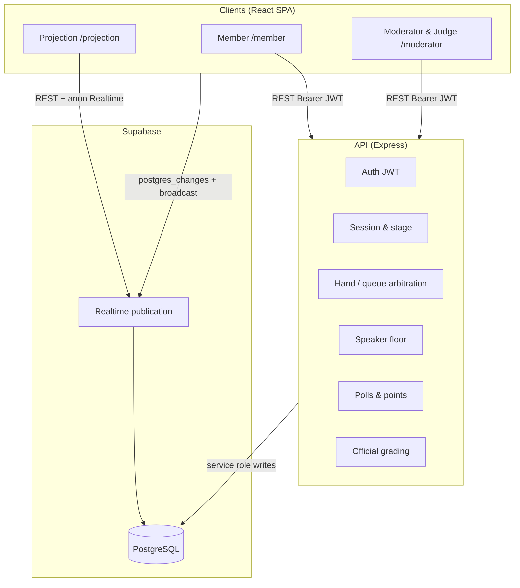
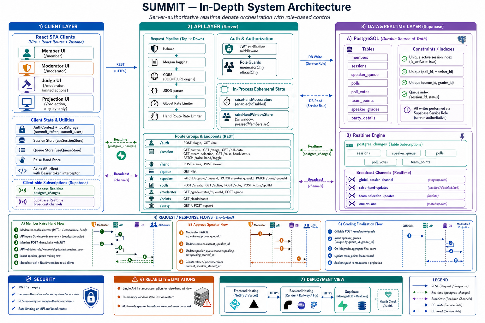
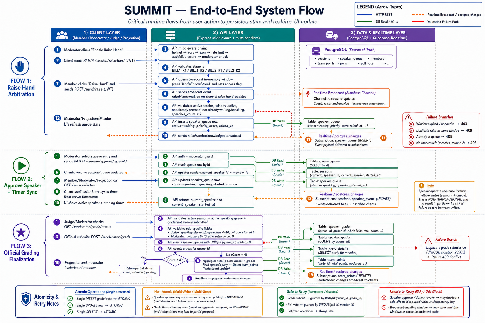

# Summit

### Real-time parliamentary session coordination for moderated debate, floor control, and hall projection.

> A realtime session coordination system for structured multi-role parliamentary workflows.
---

## Overview

Summit runs a single active debate session where a moderator advances an eight-stage lifecycle, members compete for the floor through time-boxed raise-hand windows, and judges score speakers while a projection surface mirrors floor state for the room.

The stack keeps **Postgres as the durable source of truth** (queue, session stage, bills, grades, polls) and uses **Supabase Realtime** plus targeted API broadcasts so member, moderator/judge, and display clients stay aligned without polling the full session on every change.

---

## Architecture

### High-Level Diagram



### Detailed Diagrams

#### In-Depth System Architecture



#### End-to-End System Flow



### Key Design Decisions

**Server-authoritative mutations with RLS read-only on the client**  
All writes go through Express and the Supabase **service role**; anon/authenticated clients only **SELECT** under RLS. Tradeoff: the API must stay available for every state change; clients cannot patch the DB directly.

**Hybrid state for raise-hand windows**  
A **5-second** participation window is enforced in **in-memory** maps (`raiseHandAccessStore`, `raiseHandWindowStore`) with Realtime **broadcast** for enable/disable. The speaker **queue** lives in Postgres. Tradeoff: window state is lost on API restart and is not shared across multiple API instances without a distributed store.

**Single active session row**  
`GET /session/active` and stage/bill updates resolve the row where `is_active = true` (partial unique index). Tradeoff: only one live event per database; multi-tenant or parallel sessions need a different model.

**Stage config as shared contract**  
`server/src/config/stageConfig.js` and `client/src/shared/utils/stageBehaviors.js` encode buzzer, scoring, 1v1, and speech durations (60s / 90s). Tradeoff: stage renames require coordinated server + client + DB constraint updates.

**Hall timer anchored to server time**  
`GET /session/active` includes `current_speaker_started_at` from the active `speaker_queue` row so clients can resync elapsed time after refresh. Tradeoff: timer UX depends on that field being set correctly when the moderator approves a speaker.

---

## Tech Stack

| Layer | Technology | Why |
|-------|------------|-----|
| Frontend | React 19, Vite 7, React Router 7, Zustand, Tailwind 4 | Role-split SPA with local session/queue stores and PWA-friendly build |
| Backend | Node.js 20+, Express 5 | Central validation, JWT, rate limits, service-role Supabase access |
| Database | PostgreSQL (Supabase) | Relational session, queue, grades, polls; JSONB for bills and team picks |
| Realtime | Supabase Realtime | `postgres_changes` on core tables + named broadcast channels for stage and buzzer |
| Auth | JWT (12h) + bcrypt `password_hash` on `members` | Stateless API auth; passwords verified server-side only |

---

## Features

### Workflow engine

- Eight-stage lifecycle: waiting → bill setup/debate rounds (including 1v1) → winner
- Server-validated `POST /session/stage` with canonical stage enum
- Bill metadata (`bill_1_data`, `bill_2_data`) and team selection JSON for round-2 face-offs

### Queue and arbitration

- Moderator opens a **5s** raise-hand window only in configured debate stages
- Members submit during the window; server rejects duplicate queue rows and enforces **max two** speeches per member via `speeches_count`
- Queue ordering uses priority score and timestamps (see server queue/hand routes)

### Scoring and polls

- Judges submit rubric grades on active speaker turns; moderators manage polls and poll-weighted scoring where enabled
- Team points leaderboard per session and party

### Realtime sync

- Session, queue, polls, votes, and team points propagate via Postgres Realtime subscriptions
- Stage and buzzer events use broadcast channels (e.g. `global-session-channel`, `raise-hand-updates`)

### Surfaces

| Role | Route | Purpose |
|------|-------|---------|
| `member` | `/member` | Floor participation, polls, party context |
| `moderator` | `/moderator` | Stage, buzzer, bills, queue, polls |
| `judge` | `/moderator` | Grading UI (API blocks non-moderator floor control) |
| `display` | `/projection` | Hall projection (including `DASHMOD` account) |

---

## System Flow

One path: member joins the floor during Bill 1 Round 1.

1. **Moderator** sets stage to `BILL1_R1` and enables raise-hand → API stores a 5s window in memory and broadcasts `raiseHand:enabled`.
2. **Member** calls `POST /hand/raise` inside the window → server validates window, speech quota, and duplicate queue rows → inserts `speaker_queue` with status `waiting`.
3. **Window closes** (timeout or moderator disable) → broadcast `raiseHand:disabled`; new raises are rejected.
4. **Moderator** approves a queue entry → `current_speaker_id` set, queue row `speaking`, `speaking_started_at` recorded.
5. **Clients** refetch or receive Realtime updates → projection and dashboards show the active speaker; timer sync uses `current_speaker_started_at`.
6. **Moderator** marks speech done → queue finalized, `speeches_count` incremented, floor cleared; judges can grade that turn per stage rules.

---

## Getting Started

### Prerequisites

- Node.js 20+
- A Supabase project (Postgres + Realtime)
- Environment variables (see below)

### Database (required once per project)

In **Supabase → SQL Editor**, run the entire file **`server/supabase_schema.sql`**. It resets Summit tables, applies RLS read policies, enables Realtime on the listed tables, and seeds demo users plus one active session.

Confirm in **Table Editor**: exactly **one** `sessions` row has `is_active = true`, and columns `bill_1_data`, `bill_2_data`, `team_selections` exist.

### Installation

```bash
git clone <repo-url>
cd abhimat
npm install
cd server && npm install
cd ../client && npm install
```

### Environment setup

**Server** (`server/.env` — copy from `server/.env.example`):

| Variable | Purpose |
|----------|---------|
| `SUPABASE_URL` | Project URL (must match client Supabase project) |
| `SUPABASE_SERVICE_ROLE_KEY` | Service role secret (server writes only) |
| `JWT_SECRET` | Signing secret (min 32 characters) |
| `CLIENT_URL` | Allowed CORS origins (e.g. `http://localhost:5173`) |
| `PORT` | API port (default `3001`) |

**Client** (`client/.env`):

| Variable | Purpose |
|----------|---------|
| `VITE_SUPABASE_URL` | Same project as server |
| `VITE_SUPABASE_ANON_KEY` | Anon key for Realtime subscriptions |
| `VITE_API_URL` | API base (e.g. `http://localhost:3001`; dev can use Vite proxy without setting this) |

### Running locally

```bash
# Terminal 1 — API (from repo root)
npm run dev

# Terminal 2 — UI
npm run dev:client
```

Open `http://localhost:5173`. Vite proxies `/auth`, `/session`, `/hand`, `/queue`, `/speaker`, `/polls`, `/points`, `/party` to the API.

**Demo logins** (after schema seed):

| Member ID | Password |
|-----------|----------|
| `MOD00001` | `mod` |
| `DASHMOD` | `dash` |
| `JDG10001` | `jdg` |
| `BJP10001` | `bjp` (party codes: `inc`, `aap`, `tmc`, …) |

### Quality checks

```bash
npm run verify
```

Runs client lint, production build, and server syntax check. Deployment details: **`DEPLOYMENT.md`**. Product behavior reference: **`PRD.md`**.

---

## API Reference

Non-obvious or contract-heavy routes only.

| Method | Endpoint | Auth | Description |
|--------|----------|------|-------------|
| POST | `/hand/raise` | member | Enqueue during active 5s window; enforces `speeches_count < 2` and no duplicate waiting/speaking row |
| PATCH | `/session/raise-hand` | moderator | Toggle buzzer; opens/closes in-memory window and broadcasts |
| PATCH | `/speaker/approve/:queueId` | moderator | Grants floor; sets `current_speaker_id` and `speaking_started_at` |
| POST | `/session/stage` | moderator | Updates active session stage; resolves active row server-side |
| POST | `/session/bill-data` | moderator | Persists bill name/summary JSON (`bill_number` 1 or 2) |
| GET | `/session/active` | any authenticated | Active session + speaker embed + `current_speaker_started_at` |

---

## Repository layout

```text
.github/workflows/     # CI (client lint + build, server check)
client/                 # React SPA
server/                 # Express API
  supabase_schema.sql   # Canonical database (run once in Supabase)
PRD.md                  # As-built product spec
DEPLOYMENT.md           # Hosting and Docker notes
```

---

## Known Limitations

- Raise-hand window and access flags live **in memory** on the API process; restart clears them and the moderator must re-enable the buzzer.
- **Single API instance** is assumed for consistent window enforcement; horizontal scaling needs shared window state (e.g. Redis) not implemented here.
- Stage/bill mutations target the **single** `is_active` session; misconfigured DB state (zero or multiple active rows) breaks floor control until corrected in Supabase.
- Realtime broadcast channel names must stay aligned between server sends and client subscriptions; mismatches delay UI updates until the next `GET /session/active` refetch.
- No automated integration test suite in-repo for concurrent hand-raise or queue races.

---

## What I Would Do Next

- Persist raise-hand window open/close timestamps on `sessions` (or a small `session_controls` table) so restarts and multi-instance deploys can recover window state.
- Add a unique partial index or constraint preventing duplicate `waiting`/`speaking` queue rows per `(session_id, member_id)`.
- Add an integration test that hammers concurrent `POST /hand/raise` against one open window to lock arbitration behavior.

---

## License

MIT
